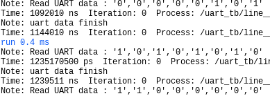

# UART_pkg
 This is a package for simulate a UART in VHDL

[package](./src/UART_pkg.vhd)

This package conatains the UART simulator. 

It has four procedures, two for writing by UART and two for reading by UART.
User only need to use uart_write_data and read_data_uart.
By default, this package uses 115200 bauds.

[example](./testbench/uart_tb.vhd)

``` vhdl
-- to import
library work;
use work.UART_pkg.all;

...
-- SEND messages
  process is
  begin
    rx <= '1';  
    wait for 10 ns;
    uart_write_data(rx, x"05", 9600); -- send in 9600 bauds
    wait for 10 ns;
    uart_write_data(rx, x"AA"); -- send in 115200 bauds
    wait for 10 ns;
    uart_write_data(rx, x"C0"); -- send in 115200 bauds
    wait;
  end process;  
  
-- READ messages
  process begin
    read_data_uart(rx, 9600); -- read in 9600 bauds
    read_data_uart(rx); -- read in 115200 bauds
    read_data_uart(rx); -- read in 115200 bauds
    wait;
  end process;
```

This package plots the following message while working.



The UART frequencies are in this blog:

-- Reference: https://soceame.wordpress.com/2023/10/27/cual-es-la-frecuencia-real-de-los-baudios-de-la-uart/
